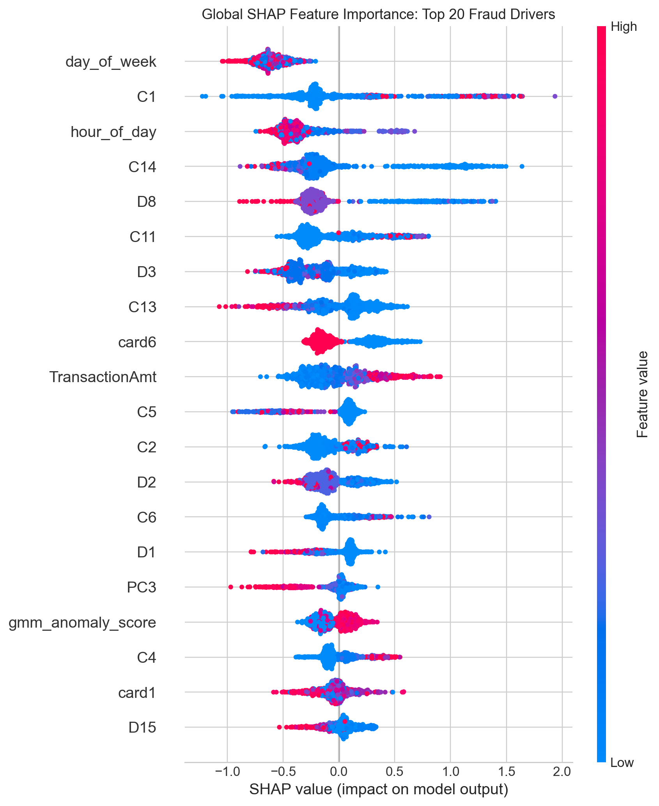
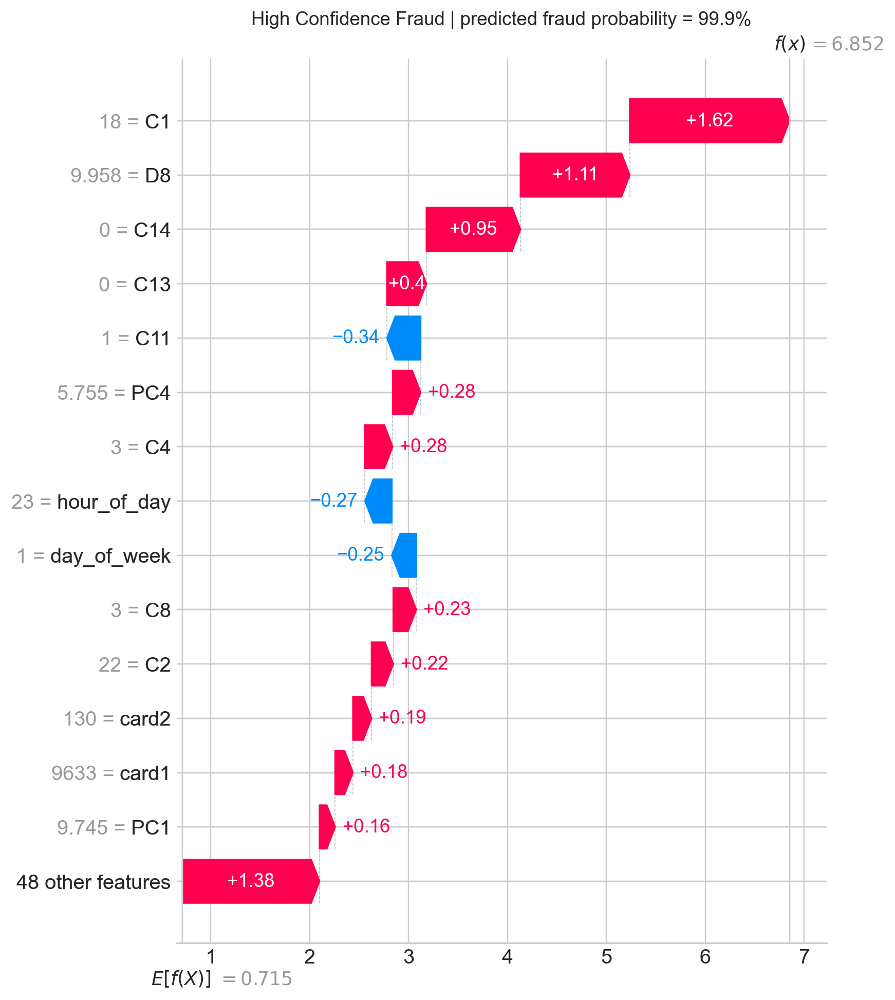
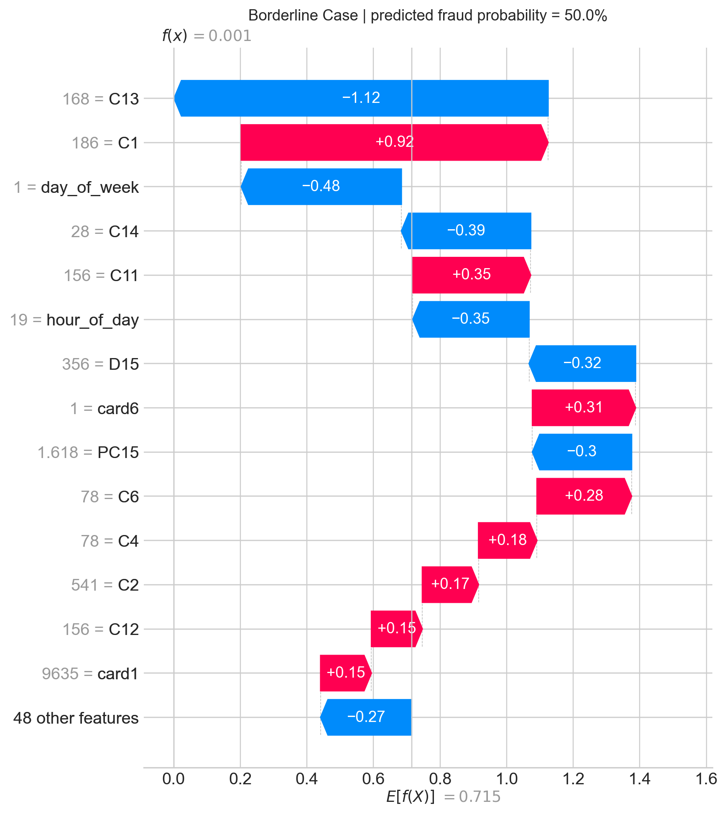
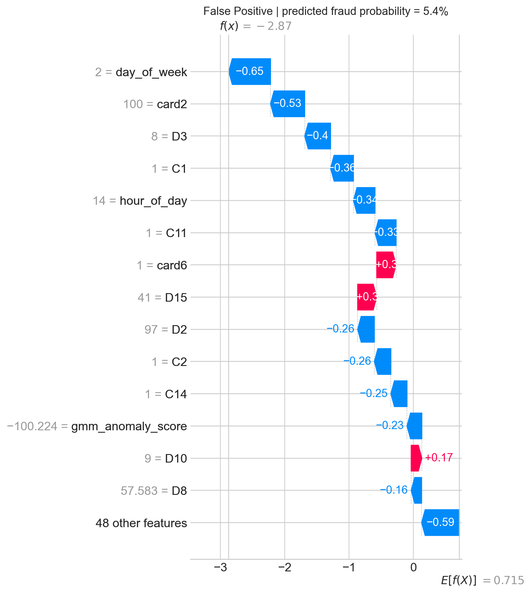

# Production-Minded Fraud Detection

An end-to-end machine-learning pipeline that detects payment fraud with **91.17% recall** on an untouched test set, while making its high-recall tradeoff, feature engineering, threshold policy, and model decisions explainable.

> Built as a portfolio project to demonstrate practical ML engineering: leakage-resistant evaluation, imbalance handling, anomaly features, model comparison, explainability, monitoring, and privacy-aware deployment design.

## Impact at a glance

| Decision | Result |
|---|---|
| Primary model | XGBoost with PCA + GMM anomaly features |
| Fraud recall | **91.17%** on the untouched test set |
| Ranking quality | **0.9326 AUC-ROC** |
| Operating threshold | **0.0536**, selected on validation data only |
| Review rate | 28.8% of transactions |
| Illustrative daily impact | ~3,190 frauds intercepted / ~$488K prevented per 100K transactions |

The operating point intentionally prioritizes catching fraud over minimizing review volume. That is why precision is 11.09%: a fraud team would review more transactions in exchange for missing fewer fraudulent ones.

## The business problem

Fraud is rare, costly, and constantly changing. A model that looks accurate can still miss most fraud, while a model optimized only for precision may let too much fraud through. This project treats fraud detection as an operational decision problem:

- Catch at least 90% of fraud on representative, imbalanced traffic.
- Select the alert threshold without looking at test labels.
- Surface why individual alerts were made.
- Plan for drift, delayed chargeback labels, privacy, and real investigator capacity.

## Results

The models were evaluated on an untouched, original-distribution test set. XGBoost was selected as the production candidate because it materially outperformed the linear baseline.

| Model | Recall | Precision | F1 | AUC-ROC |
|---|---:|---:|---:|---:|
| **XGBoost** | **91.17%** | 11.09% | 19.77% | **0.9326** |
| Linear SVM | 78.15% | 6.03% | 11.19% | 0.7507 |

### Business translation

At a threshold of **0.0536**, the model flags **28.8%** of transactions for review. If 100,000 transactions arrive in a day and the held-out test distribution remains representative, the model would identify about **3,190 fraudulent transactions before settlement**. At the observed average fraud amount of **$153.09**, that equates to an illustrative **$488,395** in prevented losses per day.

This estimate assumes every correctly flagged fraud can be stopped before settlement. In production, it should be validated against actual authorization, review, and recovery outcomes.

## Architecture

```text
Raw transaction + identity data
        |
        v
EDA: class imbalance, missingness, amount, time, and feature redundancy
        |
        v
Stratified split (70% train / 10% validation / 20% test)
        |
        +---- Cleanlab audit + SMOTE on training data only
        |     Validation and test retain real fraud prevalence
        v
Feature engineering
  median/mode imputation -> V-feature scaling -> PCA (90% variance) -> GMM
        |
        +---- 17 PCA components + GMM anomaly score/component
        v
Modeling
  XGBoost tuning on training-only sample -> final fit -> threshold selection on validation
        |
        +---- final one-time evaluation on untouched test set
        v
SHAP explanations + drift monitoring + privacy-aware deployment design
```

## What I built

### 1. Leakage-resistant training and evaluation

- Created stratified **train / validation / test** splits before any oversampling.
- Applied **SMOTE only to training data**; validation and test preserve realistic fraud prevalence.
- Used Cleanlab as a label-quality diagnostic rather than automatically deleting potentially valuable fraud examples.
- Tuned XGBoost on training-only data and selected the decision threshold on validation data. The test labels were used once for the final result.

### 2. Feature engineering that captures unusual behavior

- Reduced the high-dimensional `V1`-`V50` block with PCA, retaining **90.61%** of its variance in **17 components**.
- Fit a Gaussian Mixture Model on the PCA space and added `gmm_anomaly_score` plus cluster membership as model features.
- Centralized preprocessing artifacts so the same fitted imputer, scaler, PCA, and GMM are reused consistently at inference.

### 3. Model selection for a real operating objective

- Tuned XGBoost using a reproducible 120K-row stratified training sample for laptop-friendly experimentation, then retrained the selected configuration on all resampled training data.
- Compared XGBoost with a LinearSVC baseline trained on the PCA features.
- Chose the **highest-precision validation threshold that still achieved 90% recall**, rather than assuming the default 0.50 probability cutoff is appropriate for fraud operations.

### 4. Explainable alerts with SHAP

Global SHAP identifies the features that most influenced the saved XGBoost model, including `TransactionAmt`, PCA features, and `gmm_anomaly_score`. Local waterfall plots make individual alert decisions auditable.

| Global top-20 SHAP drivers | High-confidence fraud | Borderline case | False positive |
|---|---|---|---|
|  |  |  |  |

**High-confidence fraud — 99.9% predicted probability.** `C1`, `D8`, `C14`, and `C13` jointly pushed the prediction strongly toward fraud, with no material opposing signals among the largest SHAP contributions.

**Borderline case — 50.0% predicted probability.** `C1` increased fraud risk while `C13`, `day_of_week`, and `C14` pushed in the legitimate direction. The resulting mixed signal is exactly the kind of transaction that benefits from analyst review.

**False positive — 5.4% predicted probability.** This transaction was legitimate but still triggered an alert because the high-recall threshold is 5.36%. Its leading features reduced the fraud score, yet not quite enough to fall below the deliberately conservative threshold. This makes the cost of the recall-first policy transparent.

SHAP explains the model's use of input patterns; it does not claim that a feature caused fraud.

## Production monitoring plan

| Layer | What is monitored | Action threshold |
|---|---|---|
| Feature drift | Weekly Population Stability Index for `TransactionAmt`, PCA features, and `gmm_anomaly_score` | Investigate PSI 0.10-0.20; assess retraining when PSI > 0.20 |
| Prediction drift | Daily score distribution, mean risk score, and alert rate | Investigate an unexplained alert-rate change >25% |
| Performance drift | Rolling 30-day recall and precision once chargebacks/labels mature | Start retraining evaluation if recall <85% |
| Data quality | Schema, missingness, and transformation checks | Treat mismatch as an immediate incident |

Triggers must persist for two weekly checks before a retraining decision, except schema failures, which require immediate investigation. Candidate models are evaluated on a later time-based holdout, with the incumbent retained for rollback.

## Privacy-aware design

Financial institutions should not centralize raw card, identity, device, and transaction data simply to create a shared fraud model.

- **Federated learning:** each bank trains locally and contributes protected model updates through secure aggregation, avoiding unnecessary movement of raw customer data.
- **Differential privacy:** clip local updates and add Gaussian noise before aggregation. A practical initial privacy budget is **epsilon = 3-5**, then validate the resulting privacy/recall tradeoff with documented delta, clipping norm, and accounting method.

Federated learning reduces data movement but is not a complete privacy guarantee; model-update leakage, access controls, aggregation thresholds, and attack testing still need to be addressed.

## Tech stack

`Python` · `Pandas` · `DuckDB` · `scikit-learn` · `XGBoost` · `Cleanlab` · `imbalanced-learn` · `Optuna` · `SHAP` · `Matplotlib` · `Seaborn` · `Jupyter`

## Data and reproducibility

This project uses the [IEEE-CIS Fraud Detection dataset](https://www.kaggle.com/c/ieee-fraud-detection/data). Raw CSV files, the local DuckDB database, processed parquet files, and model binaries are intentionally excluded from GitHub: they are large, source-governed, or regenerated by the pipeline. See [data/README.md](data/README.md) for setup and [models/README.md](models/README.md) for regenerated model artifacts.

The repository does include the executed notebooks, metrics, SHAP waterfall plots, global feature-importance plot, requirements, and monitoring design so reviewers can assess the complete modeling approach without downloading hundreds of megabytes of data.

## Repository structure

```text
notebooks/
  01_eda.ipynb                  # data quality and fraud-pattern exploration
  02_cleanlab_smote.ipynb       # split design, label audit, training-only SMOTE
  03_pca_gmm.ipynb              # PCA + GMM feature engineering
  04_xgboost_svm.ipynb          # tuning, comparison, calibration, final evaluation
  05_shap_explainability.ipynb  # global/local explanations and business metrics
models/                          # persisted model and preprocessing artifacts
reports/artifacts/shap/          # saved SHAP plots and values
reports/drift_monitoring_design.md
data/README.md                   # data acquisition and local setup
models/README.md                 # regenerated model-artifact notes
```

## Reproduce

```bash
pip install -r requirements.txt
```

Run the notebooks in order:

1. `01_eda.ipynb`
2. `02_cleanlab_smote.ipynb`
3. `03_pca_gmm.ipynb`
4. `04_xgboost_svm.ipynb`
5. `05_shap_explainability.ipynb`

Notebooks 02-05 depend on persisted outputs from the preceding stage. The SHAP notebook is read-only with respect to model training: it loads the saved XGBoost model and locked validation-selected threshold.

## Next steps

1. Package the preprocessing pipeline, model, and locked threshold behind a versioned FastAPI scoring service with schema validation and audit logging.
2. Evaluate with a time-based split and compare SMOTE against class-weighted XGBoost with probability calibration.
3. Connect analyst outcomes and chargebacks to the monitoring workflow, then set a review threshold with fraud-operations capacity and loss costs.
4. Prototype secure-aggregation federated learning with differential privacy before cross-bank model collaboration.
